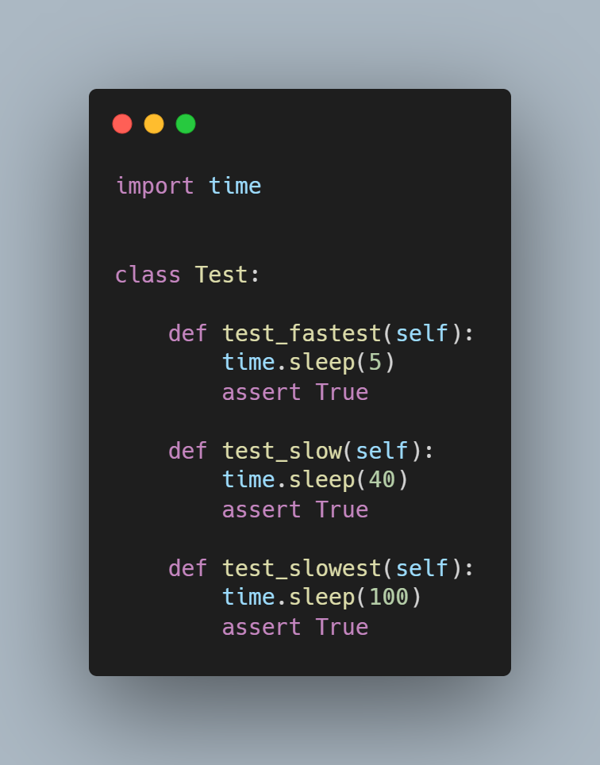
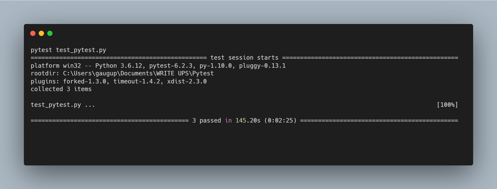

# Optimizing pytest runtime

In all these years as a software developer I have experienced that the throughput of some task in any piece of software is paramount for customers. If the software that you ship cannot scale and meet the necessary customer requirements, then there are chances that you might eventually loose that customer. Time and again as software developers, we work on scaling the software better to satisfy such customer demands. But as software developers do invest enough time and thought to run our tests faster?

Writing tests is a mandatory requirement for all software developers. As developers we are expected write unit and integration tests that are robust, less brittle (less likely to break) and provide good code coverage. But do we think that our tests should run faster? Why should tests run faster anyways? If you haven't thought about these questions then probably slower tests haven't frustrated you as much as they annoy me. 

I treat slow tests as a form of technical debt which eventually catches up with a development team. Slow tests mean longer run times for a dev-ops pipeline which means it takes longer for a developer pull request to merge into the code base. If developer pull requests take longer to run, then it invariably slows down the feature velocity and adds on to unnecessary delays for developer's features to finish and potentially leads to missing of deadlines.

Being a python developer, I run most tests using pytest testing framework. The pytest testing framework provides many extensions using which we can run the tests in parallel, enforce failing of tests if the tests exceed a particular time limit and also helps in logging of run time of the tests. I found these capabilities in pytest particularly useful in debugging which tests longer to run and save time while running a whole suit of tests. 

So get started is learning about the aforementioned  pytest extensions, let's look at a sample test file which contains a few slow tests. Below is the sample test file:-

When we run the tests in this file using pytest, we see a runtime of roughly 140 seconds.

